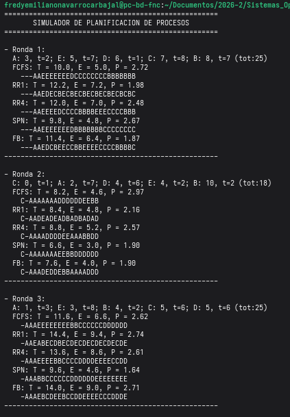
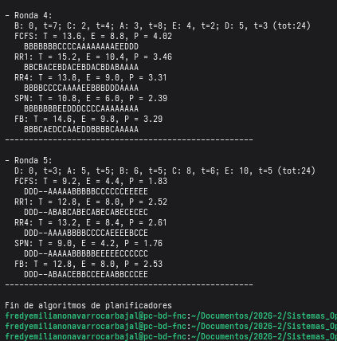

# Tarea 3:# Comparación de planificadores en C++

## Autores
 - Navarro Carbajal Fredy Emiliano 
 - Ramírez Terán Emily 

## Descripción del Proyecto
Este proyecto consiste en el desarrollo de un simulador de **planificación de procesos**  con el objetivo de evaluar y comparar el desempeño de diversos mecanismos de planificación ante cargas de trabajo aleatorias, analizando cómo cada estrategia impacta en la eficiencia del sistema.

Para lograr una comparación aceptable, se aplicaron los siguientes algoritmos, desde los más básicos hasta uno de sistemas de colas múltiples:

1.  **FCFS (First-Come, First-Served):** Este es basado estrictamente en la selección conforme al tiempo de llegada, sin interrupciones.
    
2.  **Round Robin (RR1 y RR4):**  Esta basado en el reparto equitativo del tiempo mediante un _quantum_ de 1 y 4 unidades respectivamente.
    
3.  **SPN (Shortest Process Next):** Este prioriza el proceso con el tiempo de ejecución más corto para minimizar la espera promedio.
    
4.  **FB (Feedback Multinivel):** Este ultimo basado en **3 colas de prioridad** con _quantums_ crecientes (1, 2 y 4) para castigar procesos grandes y premiar a los procesos cortos.

## Métricas de Rendimiento Aplicadas

Para medir el éxito de cada algoritmo, el programa calcula automáticamente los promedios de tres indicadores:

-   **Tiempo de Retorno (T):** Tiempo total desde que el proceso llega hasta que finaliza.
    
-   **Tiempo de Espera (E):** Tiempo acumulado que el proceso pasó en la cola de listos sin ejecutarse.
    
-   **Proporción de Penalización (P):** Relación entre el tiempo de retorno y el tiempo de servicio (T/t), que indica qué tanto se retrasó el proceso respecto a su tamaño real.

## Entorno de Ejecución
* Lenguaje de programación: C++ (versión C++17)
* Sistema Operativo: Distribución Fedora basada en Linux/Unix.
* Compilador: GCC (`g++`) con soporte para C++ estándar.


## Instrucciones de Uso

Para compilar el código desde la terminal, utiliza el siguiente comando:
```bash
g++ -std=c++17 Planificadores.cpp -o Planificadores 
```
Una vez compilado, puedes iniciar el intérprete ejecutando:
```bash
./Planificadores
```
## Estrategia de algoritmos  
La implementación del programa se centró en simular un **reloj global** que avanza segundo a segundo  entre comillas, permitiendo que cada algoritmo tome decisiones basadas en el estado actual de una queue donde están los procesos listos y el tiempo de llegada de los procesos.

### 1. **FCFS (First-Come, First-Served)**

Para este algoritmo su mecanismo funciono de la siguiente forma, donde la prioridad es detectada por el orden de llegada al programa.

 - Se recorre el vector de procesos (previamente ordenado por llegada) y se ejecutan de forma no apropiativa.
 - Si el reloj global es menor al tiempo de llegada del siguiente proceso, el progra entra en estado de descanso hasta que un nuevo proceso llegue.
 
### 2. Round Robin (RR1 y RR4)

A diferencia del algoritmo anterior, este algoritmo es **apropiativo** y busca la equidad distribuyendo el tiempo  denominadas _quantums_.

-   **Uso de Colas:** Se implementó una estructura `queue` para manejar los procesos que entran en la cola de listos.
    
-   **Gestión del Quantum:** Un proceso puede usar el programa por un tiempo máximo igual al _quantum_; si no termina, es interrumpido y reinsertado al final de la cola para permitir que otros procesos avancen.
    
-   **Actualización de llegadas** Durante la ejecución de un proceso, el algoritmo continúa monitoreando el reloj global para añadir nuevos procesos que lleguen a la fila justo a tiempo.
 
### 3. **SPN (Shortest Process Next)**

En este caso donde el algoritmo busca optimizar el tiempo de espera promedio seleccionando siempre la tarea más corta disponible, para esto usamos la siguiente lógica:

 - **Criterio de Selección**: Cada vez que el programa queda libre, el simulador realiza una búsqueda en el conjunto de procesos que ya han llegado y selecciona aquel con el tiempo de servicio (t) más pequeño.    
 
 - En este algoritmo como es **no apropiativo**, nos indica que una vez seleccionado el proceso más corto, este se ejecuta hasta su finalización antes de realizar una nueva búsqueda.

###  4. FB (Feedback Multinivel)

Este algoritmo fue el más difícil de realizar ya que su diseño sirve separar los procesos según sus necesidades del programa usando colas multinivel (3).

-   **Estructura:** Se implementaron **3 colas de prioridad** con quantums crecientes: 1, 2 y 4 respectivamente, donde 1 es el de mayor prioridad y el 4 el de menor prioridad.
    
-   **Castigo:** Primero todos los procesos nuevos ingresan a la cola 0 (máxima prioridad). Si un proceso agota su quantum sin terminar, es degradado a la siguiente cola de menor prioridad, esto como un castigo.
    
-   **Preferencia del programa:** El programa solo atenderá los procesos de una cola inferior si todas las colas de mayor prioridad están vacías, asegurando que los procesos cortos o interactivos salgan del sistema rápidamente.

## Representación Visual
Para la parte visual del programa este lo va generando conforme el tiempo avanza. De la siguiente forma:
-   **Cada segundo es un espacio:** En cada iteración del reloj global (`tiempoActual++`), el programa debe decidir qué poner en ese espacio de string _diagrama_ donde lo vamos guardando.
    
-   **Si hay un proceso ocupando en el Programa:** El programa cancela el diagrama con su identificador. Si el proceso **A** está dentro el código hace: `esquema += procesos[idx].id;` y así guardamos ese proceso con su identificador en ese tiempo.
    
-   **Si el Programa no recibe peticiones:** El programa marca un _hueco_ con un guion medio: `esquema += "-";`. 

De esta forma almacenamos cada proceso en su respectivo tiempo. 

## Ejemplos de ejecución 



## Interpretación de resultados 
En este apartado se explicara los dos patrones que surgieron en la ejecución:
### 1. Procesos Continuos (FCFS y SPN)

-   **Estructura:** Se observo que procesos como el **C** en la ronda 1 de FCFS aparecen como un bloque sólido: `CCCCCCCC` o en SPN como `BBBBBBBCCCCCCCC` .
    
-   Esto es debido a que estos algoritmos son **no expulsivos**. Es decir que vez que el proceso es tomado el programa no para hasta que termina. El esquema es una sucesión de bloques que respetan el orden de llegada (FCFS) o la duración (SPN).

### 2. Procesos Intercalado (RR1, RR4 y FB)

 - **Estructura:** En RR1 se observo casos como `EBCEBC`.

 - **Razón:** Como el algoritmo es expulsivo, al tener un quantum de 1, el sistema operativo interrumpe al proceso en cada restricción que se registra para darle turno al siguiente.
 - El caso de **FB (Feedback):** Se observa que al principio los procesos saltan mucho como AEDB, pero si son muy largos, terminan apareciendo bloques más continuos al final, esto es porque se bajaron a la última cola de prioridad, donde el quantum es más grande y hay menos competencia.


Basándonos en los datos obtenidos de las 5 rondas, podemos obtener qué algoritmo "gana" dependiendo de lo que necesitemos:

**El Ganador en EFICIENCIA: SPN (Shortest Process Next)**
Si miramos el tiempo de espera, el SPN es el campeón en casi todas las rondas:

 - Ronda 2: SPN (E=3.0) vs FCFS (E=4.6).
 - Ronda 3: SPN (E=4.6) vs RR1 (E=9.4).

Esto ya que al procesar primero a los procesos más cortos, libera espacio rápidamente en la cola de listos y evita que los procesos pequeños esperen a los gigantes. 

**El Ganador en Balance: FB (Feedback)**
Aunque como vimos el SPN es rápido, pero puede causar inanición, pero el algoritmo FB es el mejor en eficiencia:

 - En la Ronda 1, el FB obtuvo la Penalización (P) más baja de toda la ejecución (1.87).

Esto surge debido a que trata de ser rápido con los nuevos, pero no abandona a los viejos, esto ayuda a equilibrar para que nadie se queda esperando para siempre.

Y como premio honorable el algoritmo **FCFS** ya que fue el peor en las pruebas.


## Aciertos y Retos 
**Retos** El principal desafío técnico radicó en la **gestión de los contadores y las verificaciones de estado**. Fue complejo asegurar que el simulador detectara correctamente cuándo existían procesos por arribar al sistema y cuándo la cola de listos estaba realmente vacía. Si bien la lógica general resultó más fluida que en proyectos anteriores, la precisión necesaria para sincronizar el reloj global con la ráfaga de cada proceso y las interrupciones por quantum exigió un alto grado de atención al detalle.

**Aciertos** Un factor importante en el desarrollo de la tarea fue la **planificación mediante pruebas de escritorio**. Realizar el seguimiento de los algoritmos en papel antes de codificar permitió identificar errores lógicos de forma temprana y nos ahorró tiempo durante la fase de desarrollo. Este enfoque nos permitió asegurar que el comportamiento del programa fuera lo mas parecido a la teoría.

**Enseñanza** Esta tarea nos permitió comprender, a través de la experimentación directa, que no existe un algoritmo perfecto. La eficiencia de un planificador depende enteramente del contexto y de los objetivos del sistema. 
